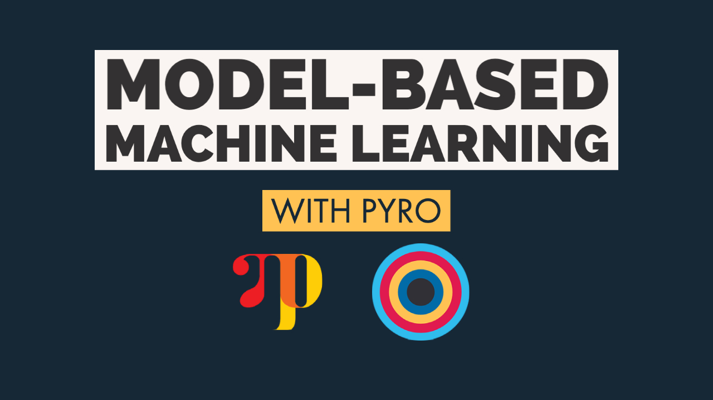

# Unclutter Your Inbox

YouTube Link -

This project shows how to build a classifier to classify emails as clutter or not clutter. Multiple machine learning models are developed and compared. All are built using model-based approach with the probabilistic framework [Pyro](https://pyro.ai/).

The project uses [Enron Email Dataset](http://www.cs.cmu.edu/~enron/), and a lot of work is done to preprocess and prepare the dataset for training the models (all scripts are included).

You can read the jupyter notebook file for details about the dataset, the preprocessing, the probabilistic models used and the implementation.

## Prerequisites:

The project is developed using [Google Colab](https://research.google.com/colaboratory/), but you can run it on your local machine provided you have python and jypyter installed.

## Tech Stack

1. [Pyro](https://pyro.ai/)
2. [NTLK](https://www.nltk.org/)
3. [Gensim](https://radimrehurek.com/gensim/)
4. [Spacy](https://spacy.io/)